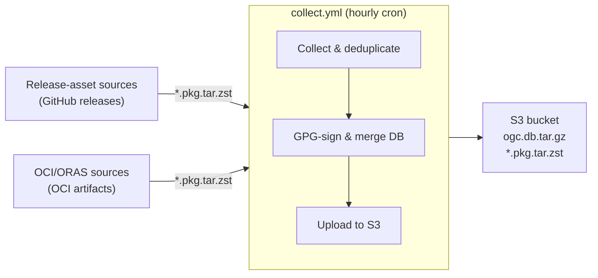

# ogc-arch-repo

> The `ogc` Arch Linux pacman repository — a live, PGP-signed home for packages from OpenGamingCollective source repos. Updated hourly.

`ogc` is the central pacman repository for OpenGamingCollective software. It doesn't build anything; it ingests prebuilt `*.pkg.tar.zst` packages from source repos' GitHub releases and OCI registries, signs them with a single PGP key, merges them into one shared database, and publishes the result to an S3-backed bucket that pacman reads directly.

## What's in the repo

- [`asusctl`](https://github.com/OpenGamingCollective/asusctl) — ASUS ROG laptop control daemon
- [`rog-control-center`](https://github.com/OpenGamingCollective/asusctl) — GUI for asusctl
- [`cardwire`](https://github.com/OpenGamingCollective/cardwire) — GPU Manager that uses eBPF LSM hooks to block GPUs
- [`linux-ogc`](https://github.com/OpenGamingCollective/kernel-packages) — OGC kernel builds
- [`linux-unstable-ogc`](https://github.com/OpenGamingCollective/linux-unstable) — OGC unstable kernel for testing and development b>

> This list is maintained by hand. The source of truth for *which repos are polled* is [`packages.toml`](./packages.toml); the list above reflects which package names those sources currently publish.

## Using the repo

Add the repo to `/etc/pacman.conf`:

```ini
[ogc]
Server = https://pacman.opengamingcollective.org
```

Import the signing key so pacman can verify packages and the database:

```bash
sudo pacman-key --recv-keys F79100EF8C802DAB81C323BB8EEA5962FE510E19
sudo pacman-key --lsign-key F79100EF8C802DAB81C323BB8EEA5962FE510E19
```

Install as usual:

```bash
sudo pacman -Syu ogc/asusctl
```

The key fingerprint is `F79100EF8C802DAB81C323BB8EEA5962FE510E19`, and the public key is published as [`ogc.asc`](./ogc.asc) in this repo.

## How it works

A single workflow — [`.github/workflows/collect.yml`](./.github/workflows/collect.yml) — runs hourly on a cron (with a manual dispatch fallback). It reads `packages.toml`, fetches the existing `ogc.db.tar.gz` from the bucket, then runs two ingestion passes:

1. **Release assets** — for each `[[packages]]` entry, polls the source repo's latest GitHub release and downloads any `*.pkg.tar.zst` assets not already in the database.
2. **OCI/ORAS** — for each `[[images]]` entry, resolves the newest build tag that has an image in the OCI registry (walking back through up to the 10 latest git tags until one has a build), pulls the image with ORAS, extracts its `*.pkg.tar.zst` files, and keeps those not already in the database.

New packages from either pass are GPG-signed, merged into the database via `repo-add`, and uploaded back to the bucket along with the updated database. The workflow is idempotent — the database itself is the source of truth for what has been ingested, so re-running it changes nothing when there's nothing new.



**One key signs everything.** A single PGP key pair signs every package (`gpg --detach-sign`) and the database itself (`repo-add --sign`). Users trust this one key regardless of how many source repos contribute packages or which ingestion path they use. The private key lives only in this repo as the `PGP_SIGNING_KEY` secret.

**Single writer.** Only this workflow writes to `ogc.db.tar.gz`. Source repos never touch the database or the bucket. A `concurrency` group prevents overlapping runs, so no S3-level locking is needed.

For the full behavioral spec — triggers, concurrency, step-by-step behavior, the dedup/merge pseudocode, and failure-mode recovery — see [`OPERATIONS.md`](./OPERATIONS.md).

## Adding a package

Adding a source is the one thing a contributor does here. No edits to any source repo are required beyond its own normal release process (tag a release, attach `*.pkg.tar.zst` assets).

### Release-asset sources

If the source repo attaches `*.pkg.tar.zst` files to its GitHub releases:

1. Confirm the source repo's release process attaches `*.pkg.tar.zst` assets. How it builds them is its own concern.
2. Append a `[[packages]]` block to [`packages.toml`](./packages.toml):
   ```toml
   [[packages]]
   repo = "OpenGamingCollective/<new-package>"
   asset_glob = "*.pkg.tar.zst"
   ```
3. Commit and push to the default branch.
4. The next hourly cron run ingests the latest release assets and publishes them. To ingest immediately, run the workflow manually with the `repo` input set to the new source (see [`OPERATIONS.md`](./OPERATIONS.md)).

### OCI-based sources

For sources that publish `*.pkg.tar.zst` files as OCI artifacts (built with [ORAS](https://oras.land/), pushed to an OCI registry such as GHCR), use an `[[images]]` block instead. The source repo must tag its OCI builds as `<version>.<build_num>` (where `<version>` is the git tag with the leading `v` stripped), plus `:latest` and any content-hash tags. This is what the [`kernel-packages`](https://github.com/OpenGamingCollective/kernel-packages) build workflow does.

1. Confirm the source repo publishes OCI artifacts to a registry this workflow can reach (public GHCR images are pulled anonymously).
2. Append an `[[images]]` block to [`packages.toml`](./packages.toml):
   ```toml
   [[images]]
   source_repo = "OpenGamingCollective/<new-source>"
   image       = "ghcr.io/opengamingcollective/<new-source>-arch"
   asset_glob  = "*.pkg.tar.zst"
   ```
   Optionally set `tag = "..."` to pin a specific build.
3. Commit and push to the default branch.
4. The next hourly cron run resolves the newest build tag that has an image (walking back through up to the 10 latest git tags until one has a build), pulls the image with ORAS, extracts the `*.pkg.tar.zst` files, and ingests any not already in the database. To run immediately, trigger the workflow manually with the `repo` input set to the new `source_repo` (see [`OPERATIONS.md`](./OPERATIONS.md)).

## `packages.toml` spec

This file is the registry of all ingestion sources. It contains two kinds of entries: `[[packages]]` for sources that attach `*.pkg.tar.zst` files to GitHub releases, and `[[images]]` for sources that publish `*.pkg.tar.zst` files as OCI artifacts (pulled with ORAS). Adding a source means appending a block and committing — the next hourly cron ingests it.

### `[[packages]]` fields

| Field | Type | Required | Description |
|---|---|---|---|
| `[[packages]]` | table | yes | Marks the start of a release-asset ingestion entry. One per source repo. |
| `repo` | string | yes | GitHub repository in `owner/name` form, e.g. `OpenGamingCollective/asusctl`. The latest release's assets are polled. |
| `asset_glob` | string | yes | Glob pattern matching the release assets to fetch. Almost always `*.pkg.tar.zst`. |

### `[[images]]` fields

| Field | Type | Required | Description |
|---|---|---|---|
| `[[images]]` | table | yes | Marks the start of an OCI/ORAS ingestion entry. One per OCI image. |
| `source_repo` | string | yes | GitHub repository in `owner/name` form whose latest git tag is used to resolve which OCI tag to pull, e.g. `OpenGamingCollective/kernel-packages`. |
| `image` | string | yes | OCI image ref to pull from, e.g. `ghcr.io/opengamingcollective/kernel-packages-arch`. |
| `asset_glob` | string | yes | Glob pattern matching the extracted files to ingest. Almost always `*.pkg.tar.zst`. |
| `tag` | string | no | Explicit OCI tag to pull. If set, tag resolution is skipped and this tag is used verbatim. If unset, the workflow reads `source_repo`'s latest git tag (e.g. `v7.1.3-ogc3.2`), strips the leading `v`, and picks the numerically highest build tag matching `<version>.<N>` from the OCI registry (e.g. `7.1.3-ogc3.2.5`). |

### Example

```toml
# Registry of ingestion sources for ogc.db.tar.gz.
# To add a release-asset source: append a [[packages]] block and commit. The hourly cron will pick it up.
# To add an OCI/ORAS source:     append an [[images]]   block and commit. The hourly cron will pick it up.

[[packages]]
repo = "OpenGamingCollective/asusctl"
asset_glob = "*.pkg.tar.zst"

[[images]]
source_repo = "OpenGamingCollective/kernel-packages"
image       = "ghcr.io/opengamingcollective/kernel-packages-arch"
asset_glob  = "*.pkg.tar.zst"
```

## Limitations

- **x86_64 only.** Whatever architectures the source repos attach is what gets served. If `aarch64` or others are added later, the dedup logic must account for the `-<arch>` suffix in filenames to avoid cross-arch collisions.
- **No pruning.** When a new version of a package is ingested, `repo-add` updates the database entry to point at the new file, but the old `.pkg.tar.zst` and `.sig` files are not deleted from S3. Old versions remain reachable via their direct URL, enabling manual rollback or pinning. The bucket grows over time — this is accepted.
- **Hourly polling only.** There is no real-time ingestion. Expected lag between a source repo publishing a release and the package appearing in `ogc` is under an two hours (GitHub scheduled runs can be delayed during busy periods).
